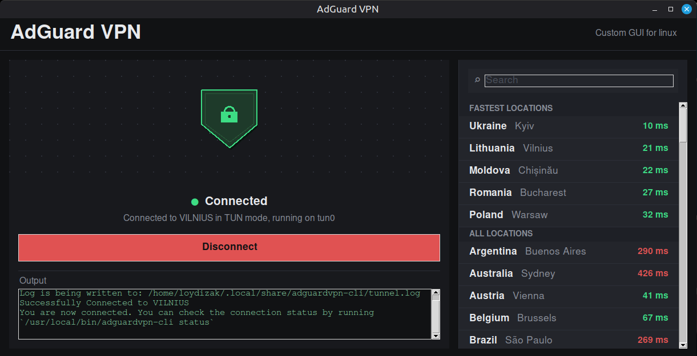

# AdGuard VPN GUI for Linux

---
AdGuard team didn't properly port their VPN on Linux for some reason, so I did it myself. It's entirely vibecoded btw.

### Features:
- **Sexy interface**
- **Pretty task bar icon**
- **Super easy installation**
- **One-click connection**

### Q&A:
- **How do I install it?**
See the [How to install](#how-to-install) section below.

- **What is this program anyway?**
Essentially, it's just a visual wrapper on top of AdGuard's original CLI application.

- **Is it safe?**
No, I will steal ALL of your data. In fact, I already did that.

- **Will it work on my PC?**
This application was only tested on Linux Mint 22.3 - Cinnamon 64-bit. Good luck.

- **Can I use your code and do my own thing?**
Yeah, whatever.

Q&A is over. \*mic drop\*


## How to install

### Get the latest binary [here](https://github.com/LoyDizak/AdGuard-VPN-GUI-for-Linux/releases/latest)

Extract the archive and run the install script:

```bash
tar -xzf adGuardvpn-gui.tar.gz
bash install.sh
```

If you don't have adguardvpn-cli installed, the install script will prompt you to install it and log in to your account

You can do it yourself later by running the following command:

```bas
adguardvpn-cli login
```

To uninstall:
```bash
bash uninstall.sh
```

## How to build

### Dependencies

- `pyinstaller`
- `tkinter`


To build run this script:

```bash
bash build.sh
```

The binary will appear in the `builds/` folder.